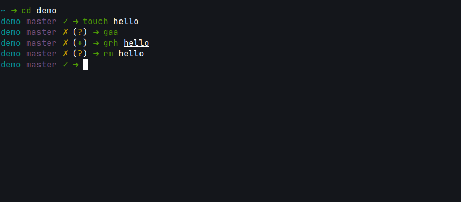

# Elessar theme
Theme based on [Gitster](https://github.com/shashankmehta/dotfiles/blob/master/thesetup/zsh/.oh-my-zsh/custom/themes/gitster.zsh-theme).



<sub>[FiraCode](https://github.com/tonsky/FiraCode) typography was used in this demo</sub>

## Requirements
1. [z shell](https://www.zsh.org)
2. [Oh My Zsh](https://ohmyz.sh)
3. A [Powerline Font](https://github.com/powerline/fonts) must be installed and used in your terminal


## Installation
First download Elessar theme:
```console
  $ mkdir -p $ZSH_CUSTOM/themes && curl https://raw.githubusercontent.com/fjpalacios/elessar-theme/master/elessar.zsh-theme -L -o $ZSH_CUSTOM/themes/elessar.zsh-theme
```

Then set the theme in your **~/.zshrc** file: 
```
  ZSH_THEME="elessar"
```

## Customization
**Multiline:**
Now you have a `local multiline=false` initial line of configuration.
The default appearance is the same as always, but now you have the option to
turn your favorite prompt into a multi-line one. Just by switching
`local multiline=false` into `local multiline=true`.

**Directory first:**
With `local directoryFirst=false` in config file, you can change the prompt's elements position to be like [rubbyrussel](https://github.com/ohmyzsh/ohmyzsh/wiki/Themes#robbyrussell) theme. For this porpose, just switch `local directoryFirst=false` into `local directoryFirst=true`

## Contribute
Feel free to send a [PR](https://github.com/fjpalacios/elessar-theme/pulls) to improve this theme!
